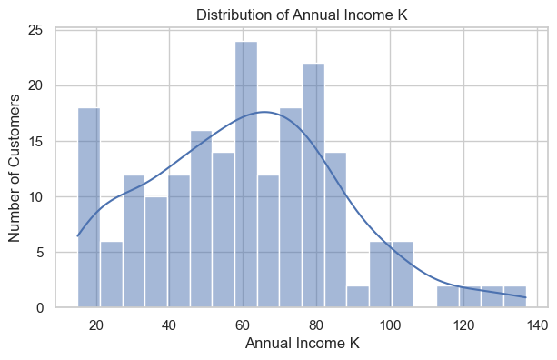
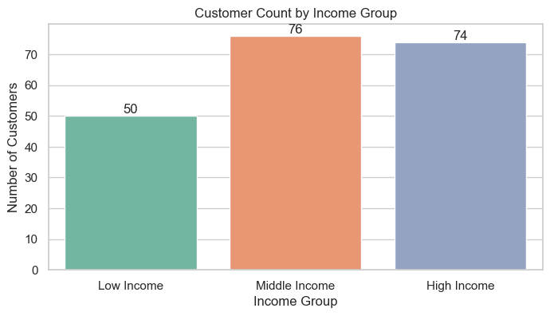
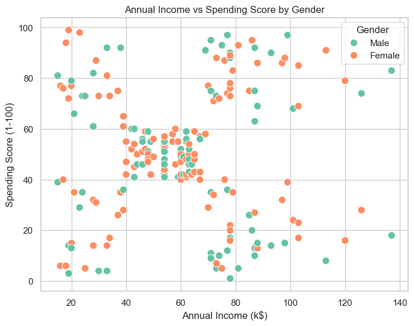
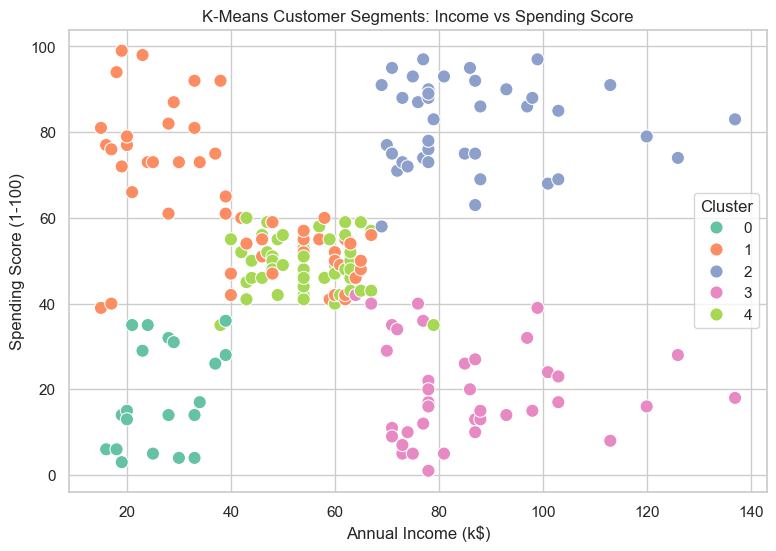

# Mall Customer Segmentation (Beginner + Business Insight Friendly)

This notebook is designed for **beginners in AI/ML** and for readers who want **clear business insights**.
It uses unsupervised learning (mainly K-Means clustering) to segment mall customers based on:
- Age
- Annual Income
- Spending Score

The analysis is simple to follow, with step-by-step visuals and practical interpretation for product, marketing, and campaign decisions.

Notebook: `Mall_Customer_Segmentation_Phyo_Thaw.ipynb`

## Why this notebook is beginner friendly
- Uses common Python libraries (`pandas`, `seaborn`, `matplotlib`, `scikit-learn`)
- Explains clustering through visual exploration before model decisions
- Includes business interpretation after technical results

## Why this notebook is business insight friendly
- Identifies high-value and low-value customer groups
- Highlights differences in customer behavior by income and spending
- Supports actions like targeted offers, premium campaigns, and retention strategies

## Key Graphs

### 1) Income Distribution
Shows how customer annual income is distributed.

### 2) Income Comparison by Group
Compares customer counts across income groups (Low / Mid / High).

### 3) Annual Income vs Spending (by Gender)
Shows how spending behavior differs across income levels and gender.

### 4) K-Means Segments: Income vs Spending
Visualizes customer segments that can be used for product and marketing strategy.

